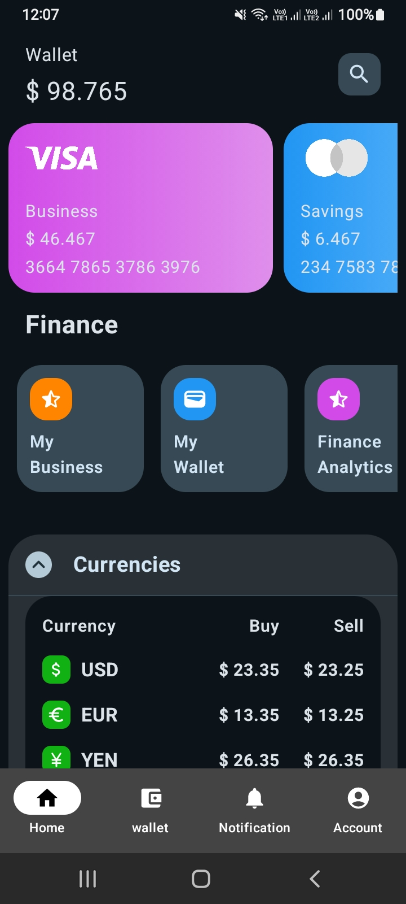
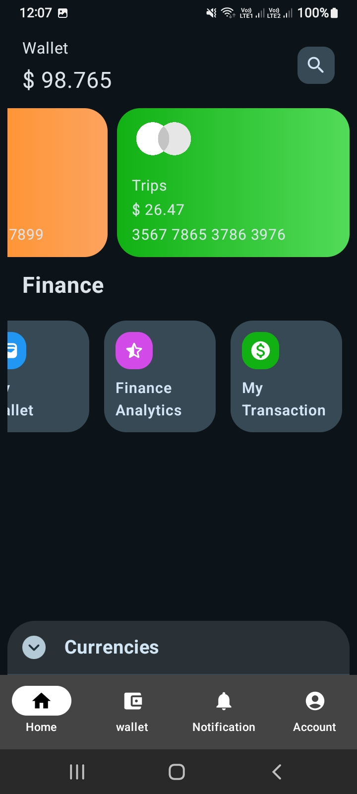

# 🏦 Banking App - Modern UI 💳

A professional and modern Banking Application UI built using **Jetpack Compose** and **Material 3**. This project demonstrates a clean, intuitive, and responsive design for financial applications.

---

## 🚀 Overview
**Banking App** is a UI-focused project designed to showcase modern Android development practices. It features a sleek dashboard with wallet management, card carousels, financial analytics shortcuts, and real-time currency tracking.

---

## ✨ Features
- 💰 **Wallet Section**: Quick view of your total balance.
- 💳 **Card Carousel**: Beautifully designed, horizontal-scrolling bank cards (Visa/Mastercard) with custom gradients.
- 📊 **Finance Shortcuts**: Quick access to Business, Wallet, Analytics, and Transactions.
- 💱 **Currency Tracker**: An interactive, expandable section to monitor global currency rates (USD, EUR, YEN).
- 📱 **Modern Navigation**: A clean Bottom Navigation bar for seamless app exploration.
- 🌓 **Dynamic UI**: Built with Material 3, supporting a modern look and feel.

---

## 🛠️ Tech Stack
This project uses the latest tools and libraries in the Android ecosystem:

- **Language**: [Kotlin](https://kotlinlang.org/) - 100% Type-safe and modern.
- **UI Framework**: [Jetpack Compose](https://developer.android.com/jetpack/compose) - Declarative UI toolkit.
- **Design System**: [Material 3](https://m3.material.io/) - Google's latest design guidelines.
- **Icons**: [Material Icons Extended](https://developer.android.com/reference/kotlin/androidx/compose/material/icons/package-summary) - For a rich visual experience.
- **Animations**: [Compose Animations](https://developer.android.com/jetpack/compose/animation) - Smooth transitions like `animateContentSize`.

---

## 📂 Project Structure
The code is organized into logical packages for better maintainability:

```text
com.example.banking_app/
├── 📁 Data/                # Data Models (Card, Finance, Currency)
├── 📁 ui/
│   └── 📁 theme/           # Theme, Colors, and Typography
└── 📁 ui_screen/           # UI Components & Screens
    ├── 📄 cards.kt         # Card Carousel UI
    ├── 📄 currencies.kt    # Currency List UI
    ├── 📄 finance.kt       # Finance Shortcuts UI
    ├── 📄 main_screen.kt    # Main Scaffold and Navigation
    └── 📄 wallet_section.kt # Wallet Balance UI
├── 📄 MainActivity.kt      # App Entry Point
```

---

## 🧩 How it Works
1. **MainActivity**: The starting point that applies the `Banking_AppTheme` and loads the `Bottom_nav`.
2. **Main Screen**: Uses a `Scaffold` to provide a `BottomNavigationBar`. The content is a `Column` that stacks all the sections.
3. **Data Layer**: Simple Kotlin data classes located in the `Data` package manage the state and information for cards and currencies.
4. **UI Components**: Each section (Wallet, Cards, Finance, Currencies) is a modular Composable function, making the code reusable and easy to read.

---

## 📸 Screenshots
<p align="center">
    
    
</p>

---

## 🌟 Topics Covered
- [x] Jetpack Compose Layouts (`Column`, `Row`, `Box`).
- [x] Lazy Lists (`LazyRow`, `LazyColumn`).
- [x] State Management (`remember`, `mutableStateOf`).
- [x] Custom Gradients and Shapes.
- [x] Material 3 Components & Theming.
- [x] UI Animations and Transitions.


