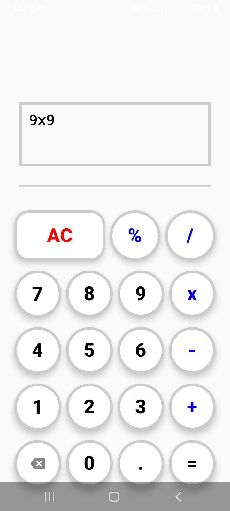
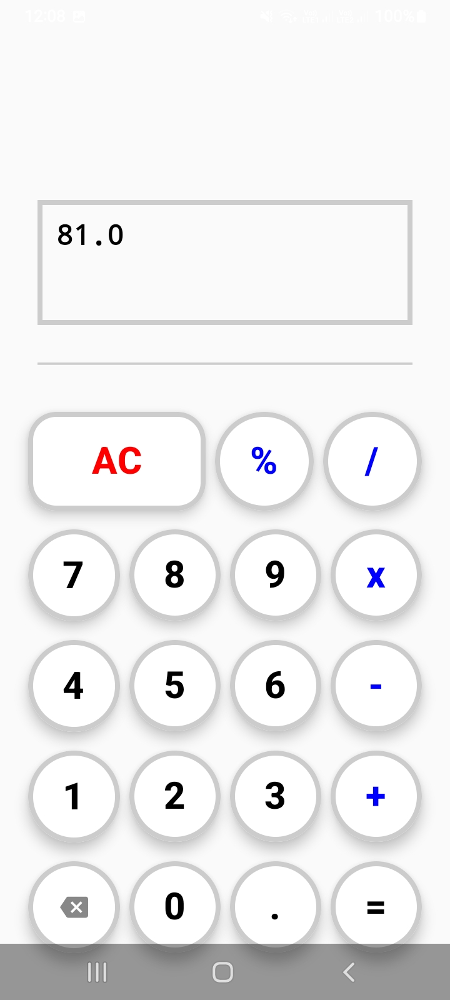

# 🧮 CalculatorApp - A Modern Android Calculator

Welcome to **CalculatorApp**! This is a sleek, modern, and highly functional calculator built with the latest Android development tools. It features a clean user interface and robust logic to handle your everyday mathematical needs.

---

## 🚀 What It Does
CalculatorApp allows users to perform standard arithmetic operations with ease. Whether you're adding up bills or calculating percentages, the app provides a smooth and responsive experience.

### ✨ Key Features
-   ➕ **Basic Arithmetic:** Addition, Subtraction, Multiplication, and Division.
-   🔢 **Decimal Support:** Precise calculations with floating-point numbers.
-   🔙 **Delete & Clear:** Quickly fix mistakes with the backspace icon or clear everything with the 'AC' button.
-   📉 **Percentage Calculation:** Easily calculate percentages for discounts or tips.
-   🎨 **Modern Design:** Beautifully crafted UI with rounded buttons, borders, and subtle shadows for a tactile feel.
-   📱 **Responsive Layout:** Works seamlessly across different screen sizes.

---

## 🛠 Tech Stack
This project is built using **Modern Android Development (MAD)** practices:

-   **[Kotlin](https://kotlinlang.org/):** The primary programming language for concise and safe code.
-   **[Jetpack Compose](https://developer.android.com/jetpack/compose):** Android’s modern toolkit for building native UI entirely in Kotlin.
-   **[ViewModel](https://developer.android.com/topic/libraries/architecture/viewmodel):** To manage UI-related data in a lifecycle-conscious way.
-   **[Material 3](https://m3.material.io/):** The latest version of Google’s open-source design system.
-   **State Management:** Utilizing `mutableStateOf` and Unidirectional Data Flow (UDF).

---

## 📂 Project Structure
Here is a breakdown of how the project is organized:

-   **`MainActivity.kt`**: The entry point of the app. It initializes the theme and sets the content.
-   **`Calculator_Ui.kt`**: The heart of the UI. It contains the `@Composable` functions that define the calculator's grid, buttons, and display.
-   **`ViewModel_Calculator.kt`**: The "brain" of the app. It processes user actions and updates the state of the calculator.
-   **`State.kt`**: Defines the `Calculator_State` data class, which holds the numbers and the current operation being performed.
-   **`Calculator_Action.kt`**: Uses a `sealed class` to define all possible user interactions (e.g., clicking a number, operation, or clear).
-   **`operations.kt`**: A `sealed class` that defines the mathematical symbols and operations.
-   **`ui/theme/`**: Contains the theme definitions, colors, and typography for a consistent look.

---

## 🧩 How It Works (The Connection)
1.  **User Input:** When you tap a button (like `7` or `+`), the **UI (`Calculator_Ui`)** sends a **`Calculator_Action`** to the **ViewModel**.
2.  **Logic Processing:** The **`ViewModel_Calculator`** receives this action and decides what to do—whether to append a digit, store an operator, or perform a calculation.
3.  **State Update:** Once the logic is processed, the ViewModel updates the **`Calculator_State`**.
4.  **UI Refresh:** Because the UI is observing the state, it automatically refreshes (**recomposes**) to show the new numbers or the final result on the screen.

---

## 📸 Screenshots

    
    

