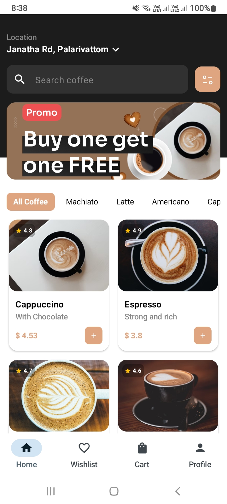
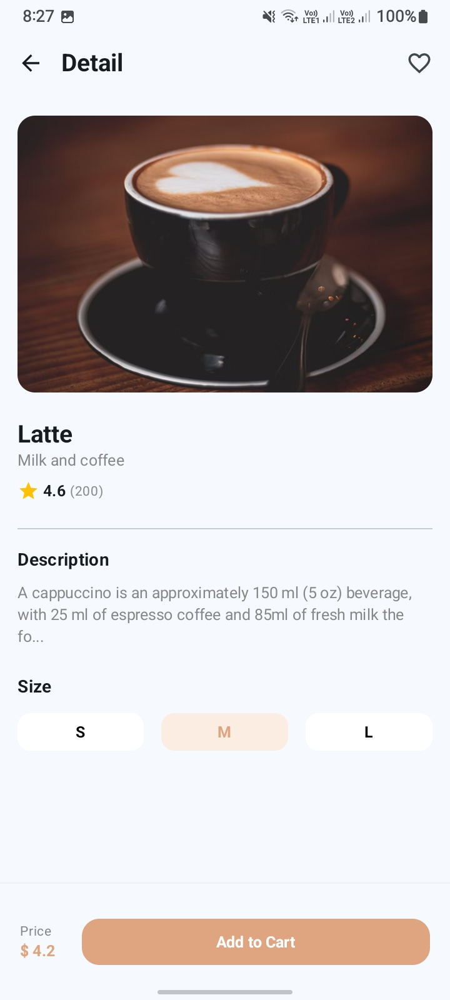
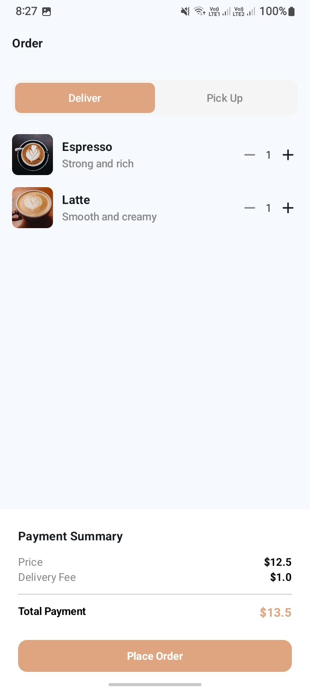
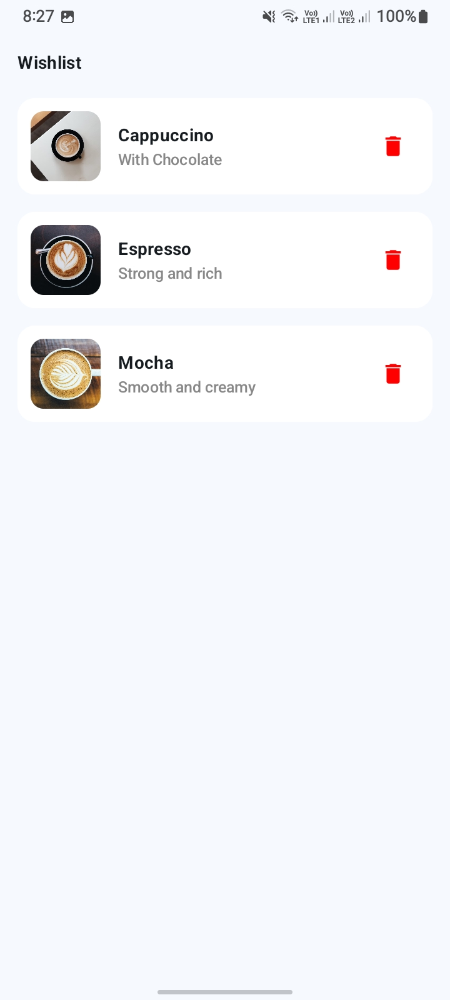
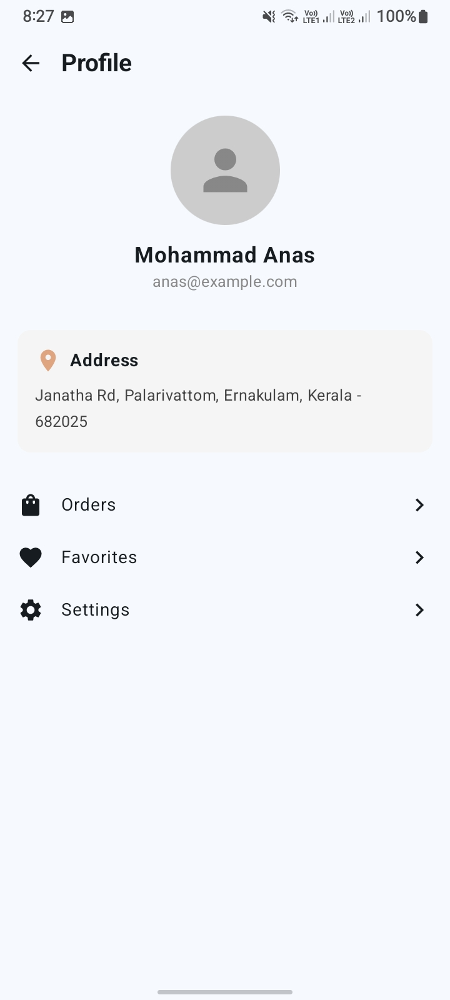

# ☕ CoffeeApp - Premium UI with Jetpack Compose

A modern, sleek, and fully responsive Coffee Application built with **Jetpack Compose**. This project focuses on high-quality UI/UX design, interactive elements, and robust navigation, providing a delightful user experience for coffee enthusiasts.

---

## 📸 Screenshots

  
  
  

  
  
  

### [Screenshots Gallery]
- **Welcome Screen**: Beautiful landing with gradient overlays.
- **Home Screen**: Dynamic dashboard with search, promo, and categories.
- **Detail Screen**: Interactive product view with size selection.
- **Order Summary**: Complete cart management and payment breakdown.
- **Wishlist & Profile**: Personalized user sections.

---

## 🌟 Features
- **Responsive Layouts:** The UI automatically adjusts to different screen sizes using adaptive grids and flexible proportions.
- **Dynamic Selection:** Interactive selection for coffee flavors and cup sizes (S, M, L) with instant UI feedback.
- **Smooth Navigation:** A complete flow from a beautiful Welcome screen to a detailed Product view and Order Summary.
- **Clean Order Management:** A dedicated screen to manage your cart, quantities, and delivery options.
- **Modern Aesthetics:** Uses rounded corners, gradients, and a rich color palette (featuring signature Coffee Brown `#DEA580`).

---

## 🛠 Tech Stack
- **Kotlin:** The primary language for modern Android development.
- **Jetpack Compose:** A declarative UI toolkit for building native Android interfaces.
- **Material Design 3 (M3):** The latest design system for a consistent and modern look.
- **Jetpack Navigation:** Seamless transitions between different app screens.
- **State Management:** Efficient use of `remember`, `mutableStateOf`, and `mutableStateListOf` to keep the UI in sync with data.

---

## 📂 Project Structure & Code Flow

The project is structured logically to keep the code organized and easy to understand:

### 🚀 Application Entry
- **`MainActivity.kt`**: The heart of the app. It hosts the `CoffeeAppNavigation`, which defines all the routes (Welcome, Home, Detail, etc.) and manages the app's overall flow.

### 🎨 UI Screens (`com.example.coffeeapp.UiScreens`)
- **`Welcome.kt`**: The onboarding experience. Uses a full-screen background image with a gradient overlay to welcome the user.
- **`Home.kt`**: The main hub.
    - Features a **Header** with location details.
    - Includes a custom **Search Bar** and a **Promo Banner**.
    - Displays **Category Chips** for easy filtering.
    - Uses a **LazyVerticalGrid** for a responsive coffee product list.
- **`coffeeItem.kt`**: The Detail screen. Shows in-depth info about a coffee item, rating, and size selection.
- **`OrdersList.kt`**: The Order Summary/Cart screen. Handles quantity adjustments, delivery/pickup toggles, and payment summaries.
- **`Whislist.kt`**: A minimalist screen to view saved favorite coffees.
- **`Profile.kt`**: Manages user profile information and delivery addresses.

### 📦 Data Layer (`com.example.coffeeapp.data`)
- **`Coffee.kt`**: A data class that defines the core Coffee model (Price, Rating, Image, etc.).
- **`FlavorData.kt`**: A simple model for categorization.

### 🖌 Styling (`com.example.coffeeapp.ui.theme`)
- **`Theme.kt`, `Color.kt`, `Type.kt`**: Centralizes the app's look and feel, ensuring consistent colors and professional typography across all screens.

---

## ⚙️ How the Code Works (The Flow)
1.  **Launch:** The app starts at `MainActivity`, which immediately shows the `WelcomeScreen`.
2.  **Onboarding:** Clicking "Get Started" navigates the user to the `HomeScreen`.
3.  **Discovery:** In the `HomeScreen`, users can search or tap on categories. The **Single Selection** logic ensures that only one flavor is active at a time.
4.  **Deep Dive:** Tapping on a coffee card opens the `CoffeeDetailScreen`, passing the specific coffee's ID to fetch its details.
5.  **Checkout:** From the detail screen or navigation, users can reach the `OrderSummaryScreen` to finalize their purchase.

---

## 🎓 Topics Covered
- **Modern Android Architecture:** Navigation-based UI flow.
- **Declarative UI Design:** Building components that react to state changes.
- **State Lifting:** Managing data at the right level to ensure UI consistency.
- **Responsive Components:** Using `aspectRatio`, `weight`, and `Adaptive Grids`.
- **Material 3 Integration:** Utilizing the latest M3 components like `Scaffold`, `TopAppBar`, and `HorizontalDivider`.

---

*Crafted with precision for a smooth and aromatic developer experience.*
