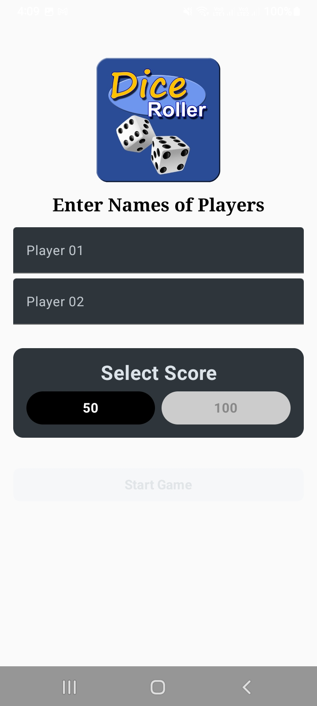
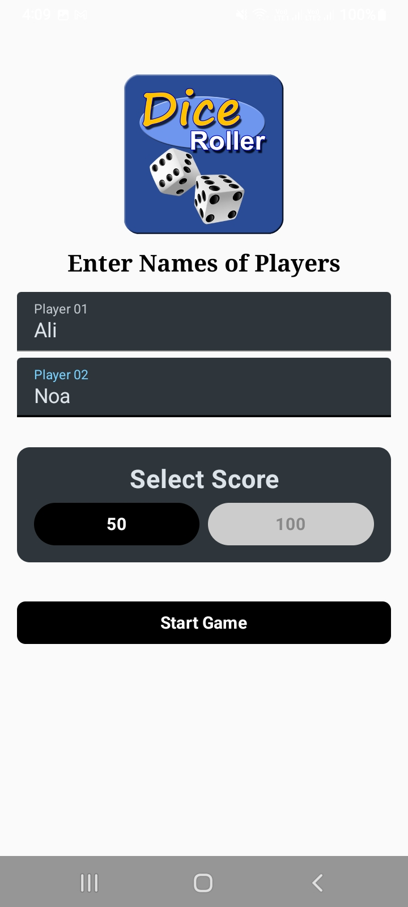

# 🎲 DiceRollerGame 🎲

Welcome to **DiceRollerGame**, a fun and interactive two-player Android application built with modern technology! This project is designed to be simple, engaging, and a great example of Jetpack Compose in action.

---

## 🚀 What it Does
DiceRollerGame allows two players to compete against each other in a classic dice-rolling race. Players input their names, choose a target score (50 or 100), and take turns rolling a virtual die. The first person to reach or exceed the target score wins the game!

### ✨ Key Features
- **👤 Player Setup:** Easy input for player names with validation.
- **🎯 Customizable Goals:** Choose between a quick game (50 points) or a longer match (100 points).
- **🎲 Animated Dice Rolls:** Experience the thrill with a visual rolling animation.
- **🔄 Turn Logic:** Automatic turn-switching with a special "Roll a 6, Roll Again" rule!
- **🏆 Winning Celebration:** A dedicated screen to celebrate the winner with a trophy.
- **📱 Modern UI:** Clean, dark-themed, and responsive design using Material 3.

---

## 📸 Screenshots
<p align="center">
    
    
</p>

---

## 🛠 Tech Stack
This project uses the latest and greatest in Android development:

- **[Kotlin](https://kotlinlang.org/):** The modern, expressive programming language for Android.
- **[Jetpack Compose](https://developer.android.com/compose):** Android's modern toolkit for building native UI.
- **[Compose Navigation](https://developer.android.com/jetpack/compose/navigation):** For seamless screen transitions and type-safe routing.
- **[Material 3](https://m3.material.io/):** The latest version of Google’s open-source design system.
- **[Coroutines](https://kotlinlang.org/docs/coroutines-overview.html):** For smooth, non-blocking dice roll animations.

---

## 📂 Project Structure
Here’s a quick guide to how the code is organized:

```text
app/src/main/java/com/example/dicerollergame/
├── MainActivity.kt        # The entry point that starts the app and navigation.
├── navigation/            # 🗺️ Navigation logic
│   ├── Routes.kt          # Defines the different screens (routes).
│   └── navGraph.kt        # Connects the routes to their respective screens.
├── playyers/              # ✍️ Player Setup
│   └── PlayersScreen.kt   # Screen for entering names and choosing the score.
├── diceRollerGame/        # 🎲 Core Gameplay
│   ├── GameScreen.kt      # Main game logic, score tracking, and turn management.
│   ├── diceImage.kt       # UI components for different dice faces (1-6).
│   └── topBar.kt          # Custom top bar component.
├── winning/               # 🏆 Victory
│   └── WinningScreen.kt   # The celebration screen for the winner.
└── ui/theme/              # 🎨 Styling
    └── ...                # Theme, Color, and Typography definitions.
```

---

## 🔗 How it Works
1. **Starting Point:** `MainActivity` initializes the `DiceRollerGameTheme` and sets up the `NavGraph`.
2. **Setup:** The `NavGraph` first points to the `Players` screen where users enter their details.
3. **Gameplay:** Once "Start Game" is clicked, the app navigates to the `GameScreen`, passing the player names and target score as arguments.
4. **Logic:** The `GameScreen` uses Compose state (`mutableStateOf`) to track scores and whose turn it is. When the "Roll" button is clicked, a coroutine triggers an animation and then updates the score.
5. **Winner:** When a score reaches the limit, the app navigates to the `WinningScreen` to display the winner's name.

---

## 📚 Topics Covered
- Type-safe Navigation in Compose.
- State Management (`remember`, `mutableStateOf`, `rememberSaveable`).
- Layouts (Column, Row, Box, Scaffold).
- Animations with `Animatable`.
- Material 3 Components (Cards, Buttons, TextFields).
- Passing data between screens.
- Basic Coroutine usage for delays.


