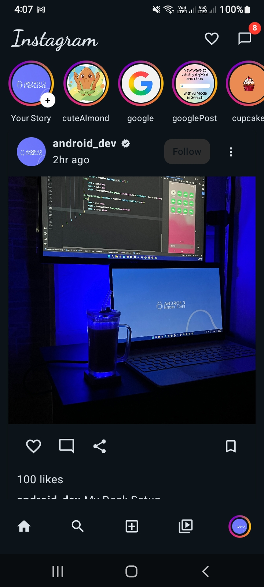
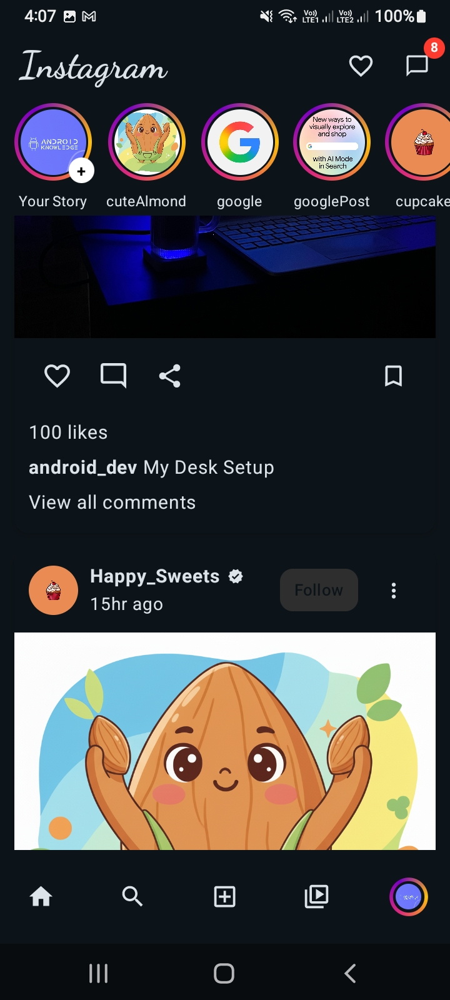

# 📸 Instagram UI Clone - Jetpack Compose

A modern, sleek, and highly responsive **Instagram UI Clone** built using **Jetpack Compose** and **Material Design 3**. This project demonstrates the power of declarative UI in Android development by replicating the core look and feel of the Instagram app.

---

## 🚀 Features

*   **✨ Stunning Top Bar**: Includes the iconic Instagram branding with a cursive font and quick access to notifications and messages (with a live-style badge).
*   **📱 Interactive Stories**: A smooth, horizontally scrollable Story bar featuring the signature gradient rings and an "Add Story" indicator.
*   **📰 Rich Post Feed**: Beautifully crafted post cards with user profiles, verified badges, high-quality images, and full interaction suites (Like, Comment, Share, Save).
*   **🧭 Bottom Navigation**: Easy switching between Home, Search, Create, Reels, and Profile sections using a clean Material 3 Navigation Bar.
*   **🎨 Dynamic Theming**: Built with Material 3, supporting a consistent and modern look across the app.
*   **🖌️ Custom Canvas Drawing**: Real-time rendering of the Instagram-style story gradient using Android's Canvas API.

---

## 🛠️ Tech Stack & Modern Tools

This project leverages the latest Android development technologies:

*   **[Kotlin](https://kotlinlang.org/)**: The primary programming language for modern Android development.
*   **[Jetpack Compose](https://developer.android.com/compose)**: Android’s modern toolkit for building native UI.
*   **[Material 3 (M3)](https://m3.material.io/)**: The latest version of Google’s open-source design system.
*   **[Lazy Layouts](https://developer.android.com/develop/ui/compose/lists)**: Efficiently handling large lists with `LazyRow` and `LazyColumn`.
*   **[Canvas API](https://developer.android.com/develop/ui/compose/graphics/draw/canvas)**: Used for custom UI elements like the story gradient rings.

---

## 📂 Project Structure

The project follows a clean and modular directory structure:

*   📂 **`MainActivity.kt`**: The heart of the app. It initializes the UI and applies the `InstagramTheme`.
*   📂 **`UI_Insta.kt`**: The main scaffold that coordinates the Top Bar, Bottom Bar, and the main scrollable content.
*   📂 **`StoriesList.kt`**: Dedicated component for the horizontal stories section, including the custom gradient ring logic.
*   📂 **`post.kt`**: Manages the individual post UI (`PostImageCard`) and the main feed list (`theme`).
*   📂 **`data.kt` & `post_data.kt`**: Data models that power the dynamic content of the app.
*   📂 **`ui/theme/`**: Contains the Material 3 color schemes, typography, and shapes.

---

## 📸 Screenshots

    
    
    

---

## 🏗️ How it Connects

1.  **Entry Point**: `MainActivity` starts the app and wraps everything in `InstagramTheme`.
2.  **Main Layout**: `insta()` (in `UI_Insta.kt`) creates the `Scaffold`. It places the `TopAppBar` at the top and `NavigationBar` at the bottom.
3.  **Content Injection**: Inside the `Scaffold` body, a `Column` hosts:
    *   `storyList()`: Fetches data from `list` and displays stories.
    *   `theme()`: Fetches data from `posts` and displays the scrollable feed using `PostImageCard`.
4.  **Data Flow**: Data classes in `data.kt` and `post_data.kt` ensure that the UI components remain decoupled and easy to manage.

---

## 👨‍💻 Developed By

**[codecraft732]**  
*Passionate Android Developer*

---

⭐ **If you find this project helpful, don't forget to give it a star!**
