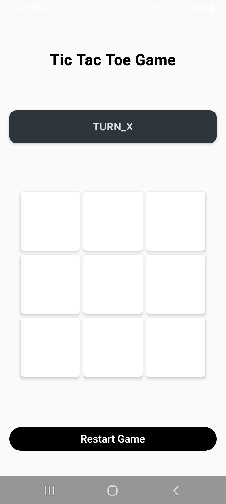
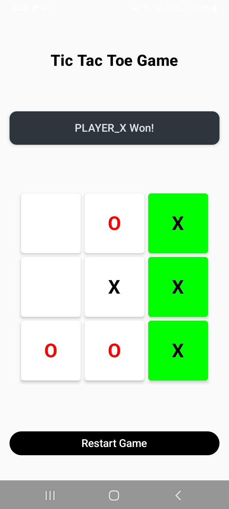
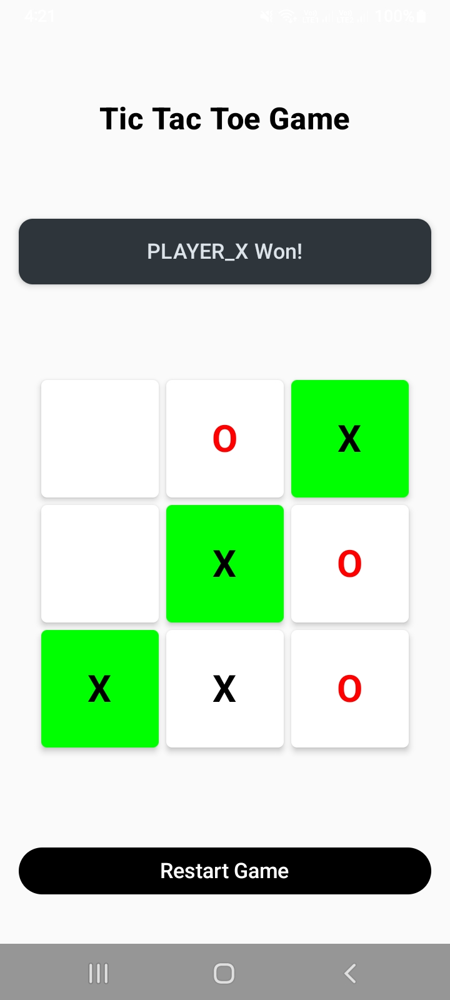
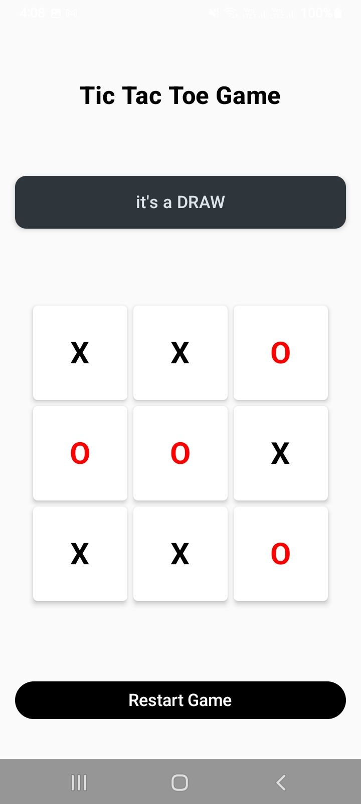

# 🎮 Tic Tac Toe - Modern Android Game

Welcome to the **Tic Tac Toe Game**, a sleek and modern Android application built with **Jetpack Compose**. This project demonstrates the power of declarative UI and clean architecture in Android development.

---

## 📝 About the Project

This is a classic 3x3 Tic Tac Toe game designed for two players. It provides a smooth, interactive experience with real-time state updates, win highlights, and a responsive design that works perfectly on different screen orientations.

### ✨ Key Features
- **🎮 Interactive Gameplay**: Smooth tapping experience for Player X and Player O.
- **🏆 Win Detection**: Automatically detects winners in rows, columns, and diagonals.
- **🎨 Dynamic Highlighting**: The winning cells turn **Green** to celebrate the victory!
- **🤝 Draw Support**: Smartly detects when the game ends in a draw.
- **🔄 Instant Restart**: Reset the board anytime with a single tap.
- **📱 Responsive UI**: The board automatically adjusts its size for Portrait and Landscape modes.

---

## 📸 Screenshots

<p align="center">
    
    
   
   
</p>

---
## 🚀 Tech Stack

This project uses the latest and most modern technologies in Android development:

- **[Kotlin](https://kotlinlang.org/)**: The modern, expressive programming language for Android.
- **[Jetpack Compose](https://developer.android.com/compose)**: Android’s modern toolkit for building native UI.
- **[Material 3](https://m3.material.io/)**: The latest version of Google’s open-source design system.
- **[MVVM Architecture](https://developer.android.com/topic/architecture)**: Ensures a clean separation of concerns between Logic and UI.
- **[ViewModel](https://developer.android.com/topic/libraries/architecture/viewmodel)**: Manages UI-related data in a lifecycle-aware way.

---

## 🏗️ Project Structure

The code is organized following the **Clean Architecture** principles:

```text
com.example.tictactoegame
├── 📂 Data
│   └── UiStates.kt       # Enums for Players, Game Status, and Cell States.
├── 📂 viewModel
│   └── GameViewModel.kt  # The "Brain" of the game (Logic & State management).
├── 📂 View
│   ├── TicTacToeGame.kt  # Main Screen layout.
│   ├── Board.kt          # 3x3 Grid logic and responsiveness.
│   └── cell.kt           # Individual cell design and click handling.
└── MainActivity.kt       # App entry point & Theme setup.
```

### 🔗 How it all connects:
1. **MainActivity**: The starting point that hosts our `TicTacToeGame` UI.
2. **GameViewModel**: Holds the game state (the board, whose turn it is, the message). It contains the logic to check for winners.
3. **UI Components (View)**:
    - `TicTacToeGame` reads the status from the ViewModel and displays the header, board, and restart button.
    - `Board` creates the 3x3 layout.
    - `Cell` represents a single square, showing "X" (Black) or "O" (Red).

---

## 📚 Topics Covered

- ✅ **Declarative UI**: Building UI using functions with Jetpack Compose.
- ✅ **State Management**: Using `mutableStateOf` and `mutableStateListOf`.
- ✅ **Component Reusability**: Creating modular `@Composable` functions.
- ✅ **Game Logic**: Implementing algorithms for grid-based games.
- ✅ **Responsive Design**: Using `LocalConfiguration` to adapt to screen changes.


